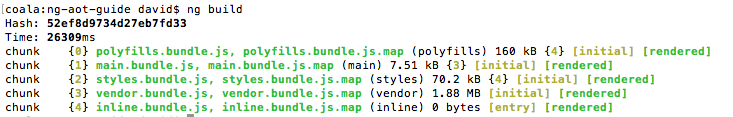
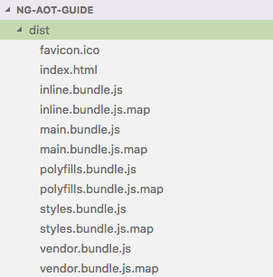
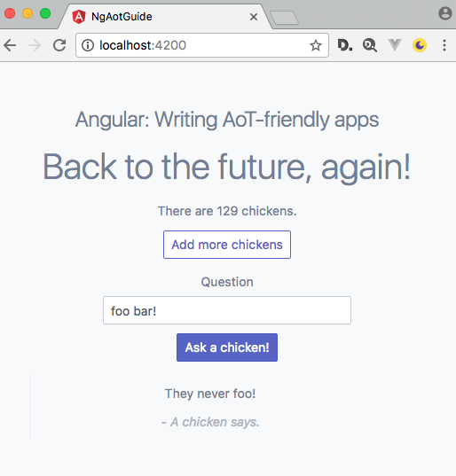
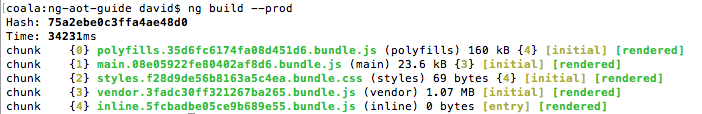
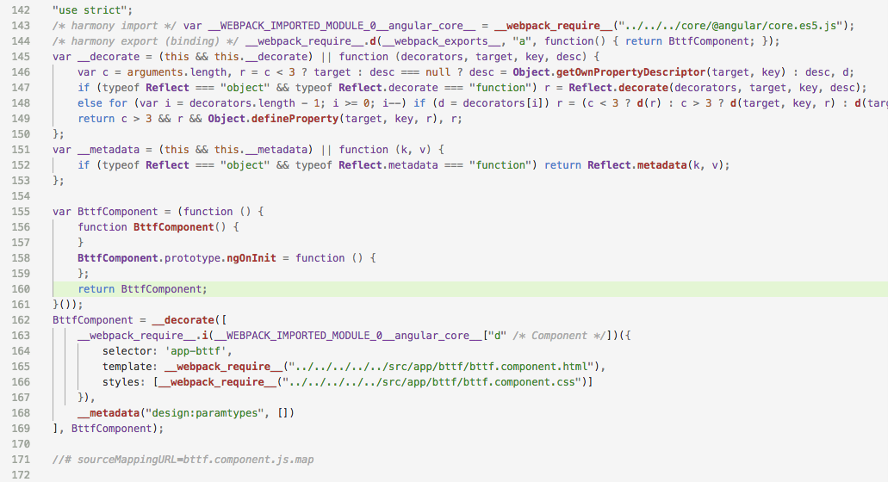
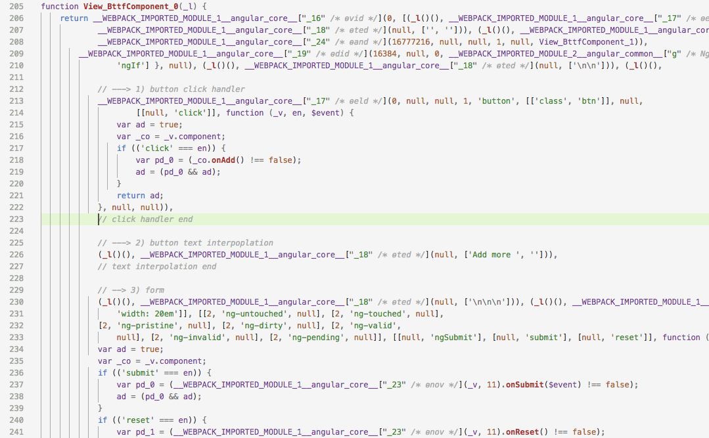

Angular: writing AoT-friendly apps
==================================

This article describes development guidelines and instructions how to write AoT-compatible apps with the Angular CLI.
It serves supplementary information to the [official Ahead-of-Time cookbook](https://angular.io/guide/aot-compiler).
The article talks through this topic by an example app.


## Kick-start a project

First, install the Angular CLI as shown below.
Since we are going to use yarn as the package manager, we set a configuration for the Angular CLI.
Then, we bootstrap a new project and add a simple CSS framework for the eye's pleasure:

```bash
$ npm install -g @angular/cli
$ ng set --global packageManager yarn
$ ng new ng-aot-guide
$ cd ng-aot-guide
$ yarn add spectre.css
```

Now, generate some application code for demonstration purposes.
We generate an `NgModule`, a `Component`, and a `Service`.

```bash
$ ng generate module bttf
$ ng generate component bttf
$ ng generate service bttf/bttf
```

A first glance at the app:

```bash
$ ng serve
```

Then open [http://localhost:4200](http://localhost:4200) and you see a screen yelling "_bttf works!_"


**NOTE**: _bttf_ is an abbreviation for _back to the future_.
Yes, it's some play of words... _ahead of time_, _back to the future_, well, err...


#### Serving and Building – w/ AoT – w/o AoT

Angular CLI comes with built-in AoT support.
In the development target environment, it uses JiT (Just-in-Time) compilation for better developer experiences and faster reloads.
In production target environment, AoT (Ahead-of-Time) compilation is used for best user experience and faster page loads.
You specifiy the build target by adding the `--dev` or `--aot` flag to the `ng` commands.

By default, it uses the development target.
Build the application:

```bash
$ ng build
```




The Angular CLI outputs the build artefacts in the `dist` folder which now looks like this:



Now, let's build for production:

```bash
$ ng build --prod
```

For an overview, here are the long-form commands for both development and production build targets:

```bash
$ ng serve --dev
$ ng serve --aot
$ ng build --dev
$ ng build --aot
```


## A chicken application

To demonstrate and understand how Ahead-of-Time compilation works, we need to add some features to the application.
Checkout the Git tag `baseline` or [take a look at that commit](./releases/tag/baseline).
The running application now looks:



This user interface is implemented by a `BttfComponent` with a `BttfService` behind.
Both component and service are located in `BttfModule`.

In JiT compilation (`ng build --dev`), the application works fine.
However, when running AoT compilation (`ng build --prod`), we encounter several errors.


#### Common Mis-Take #1: Factory functions must be exported, named functions

The first error message is:

```
Error encountered resolving symbol values statically. Function calls are not supported. Consider replacing the function or lambda with a reference to an exported function
```

It is caused in `bttf.module.ts` by the factory provider:

```ts
{
  provide: BttfService,
  useFactory: () => new BttfService()
}
```

With AoT compilation, lambda expressions (arrow functions in TypeScript jargon) are not supported for writing factories!
We have to replace the factory with a plain-old function:

```ts
export function myServiceFactory() {
  return new BttfService();
}

@NgModule({
  providers: [
    {
      provide: BttfService,
      useFactory: myServiceFactory
    }
  ]
})
export class BttfModule {}
```

You can see the solution in the Git tag `fix-1`.
[Take a look at it](releases/tag/fix-1)!

***WARNING***: the Tour-of-Heroes on [angular.io](https://angular.io/) gives a non-working example for factory providers.
The document is [outdated](https://github.com/angular/angular/issues/17042) and [needs to be updated](https://github.com/angular/angular/pull/17081)!


#### Common Mis-Take #2: bound properties must be public

Now, when running `ng build --prod` again, another error shows up:

```
Property '{xyz}' is private and only accessible within class '{component}'
```

The error is caused by two places in `bttf.component.ts` and `bttf.component.html`.
In the HTML template, we have a text interpolation binding for the headline and an event binding for the form:

```html
<h2>{{ message }}</h2>

<form #f="ngForm" (ngSubmit)="onSubmit(f.controls.question.value)">
   ...
</form>
```

In the component class, the corresponding code snippet is:

```ts
@Component({ .. })
export class BttfComponent {
 
  private message: string = `Back to the future, again!`;

  private onSubmit(value: string) {
    /* .. */
  }
}
```

Both the property and the method need to be public members!
By simply removing the `private` keyword, both will be public by default.
So, the fix for this error is:

```ts
@Component({ .. })
export class BttfComponent {
 
  message: string = `Back to the future, again!`;

  onSubmit(value: string) {
    /* .. */
  }
}
```

If you like to be even more explicit, you can declare a `public message: string` as well as a `public onSubmit()` method.
The solution is shown in Git tag `fix-2` [whose commit you find here](releases/tag/fix-2)!


#### Common Mis-Take #3: call signatures for event bindings must match

There is one more issue with the application:

```
Supplied parameters do not match any signature of call target.
```

Again, this error is caused by `BttfComponent` and its template.
The code part in the template is:

```html
<button (click)="onAdd($event)">Add more {{ items }}</button>
```

And its counter-part in the component class:

```ts
@Component({ .. })
export class BttfComponent {

  onAdd() {
    this.count += 1;
  }

}
```

Notice that `onAdd()` does not declare a method parameter.
However, in the template, we try to pass the `$event` variable to the method.
This causes AoT compilation to fail and has two possible solutions.
First, change the method implementation in the class to accept a paramter or remove the paramter from the event binding in the template.
We choose to not pass `$event` to the method since it is not needed anyway.
The fixed template code is:

```html
<button (click)="onAdd()">Add more {{ items }}</button>
```

To see the solution in Git tag `fix-3` [you can view at this commit](releases/tag/fix-3)!


#### Building with AoT

Finally, we are able to compile the application for production with AoT enabled.

```bash
$ ng build --prod
```



Did you notice the difference in file sizes?
With the development build, `vendor.bundle.js` was 1.88MB in size and `main.bundle.js` was 7.51kB.
In the production build, `vendor.bundle.js` is **reduced to 1.07MB** and `main.bundle.js` has **grown to 23.6kB**.

Here is why!
First, in production build, the JavaScript files are minified.
Second, with AoT compilation, the [Angular compiler is no longer included in the vendor bundle](https://angular.io/guide/aot-compiler#inspect-the-bundle).
The package `@angular/compiler` accounts for roughly 999kB in unmified, plain ES5 code!
As [Minko Gechev points out](http://blog.mgechev.com/2016/08/14/ahead-of-time-compilation-angular-offline-precompilation/#what-we-get-from-aot), ommitting the compiler from the vendor bundle saves us quite a few KWh of energy on the planet!
On top, [AoT applications will run much faster](https://blog.nrwl.io/angular-is-aot-worth-it-8fa02eaf64d4) in the web browser!

How is all that possible?
These performance improvements are achieved by a trade-off.
With AoT compilation, so-called factory code for components is generated.
The generated code lives in intermediate `*.ngfactory.ts` files.
The Angular CLI generates these files under the hood and does not make them visible.
Since that code needs to be included in the application, the `main.bundle.js` **is increased in file size** (from 7.51kB to 23.6kB, ~3 times even though minificaiton is applied) and the build **takes longer to execute** (from ~26sec to ~34 sec) in the above example.


## A look inside the code

To get a deep understanding of how AoT works, let's take a look at the generated factory code.

It is still possible to recognize the most important parts in the _not-so-pretty-looking_ code.
For instance, the TypeScript class `BttfComponent` is compiled to the following snippet of JavaScript code (ES5 syntax).
Basically, it's a JavaScript prototype with additional functions `__metadata()` and `__decorate()` applied to it.
All of a sudden, does it make sense that they call `@Component()` a decorator?




With AoT compilation, additional component factories are generated.
The code implements `View` classes.
We can think of views as intermediaries between the browser's runtime and the component classes.
Technically, this is probably way too over-simplified and does not meet the complexity of Angular's implementation details.
Just for simplicity of a _mental model_, let's imagine that `View` classes act like a _glueing-code proxy_ between the runtime (browser DOM) on the one side and components (implemented in TypeScript) on the other side.

For instance, you find the `_co.onAdd()` call in the following factory code.
Notice that it checks for `if(('click' == en))`, then checks the return value `_co.onAdd() !== false`, stores it in a local `pd_0` variable, and returns a boolean from evaluating `(pd_0 && ad)`.
Well, does that look familiar to you?




Think back a few years!
Did you ever write such code?

```js
elem.addEventListener(function (evt) {
  if (evt.type === 'click') {
    /* do things... */
    return true; // cancel the event
  }
});
```

I used to write such code. :-)

In 2017, we don't do these things.
As good and tame Angular developers, we write:

```html
<button (click)="onAdd($event)">Add more chicken</button>
```


The important thing here is that the factory code represents the component's HTML template in a slightly different way.
It looks like the template's HTML markup is transformed into a set of JavaScript instructions.
Actually, that transformation is performed by the Angular AoT compiler.

We cannot see type information in these code listing because it's JavaScript code where type information is lost.
When the compiler does the HTML-to-JavaScript transformation, it does so in two steps.
First, the compiler generates factory code in TypeScript and then compiles both the `*.ngfactory.ts` and `*.component.ts` files to JavaScript.

This means that the compiler performs type checking from code expressions in HTML template.
The HTML template is transformed into TypeScript factory code.
The factory code is compiled and depends on the component class.
So how could the factory invoke a `private onAdd()` method with the parameter `$event`?
It simply cannot and throws a type error!
Now we understand: we fixed exactly these kind of errors in the previous sections.


## Conclusion

__TODO__
